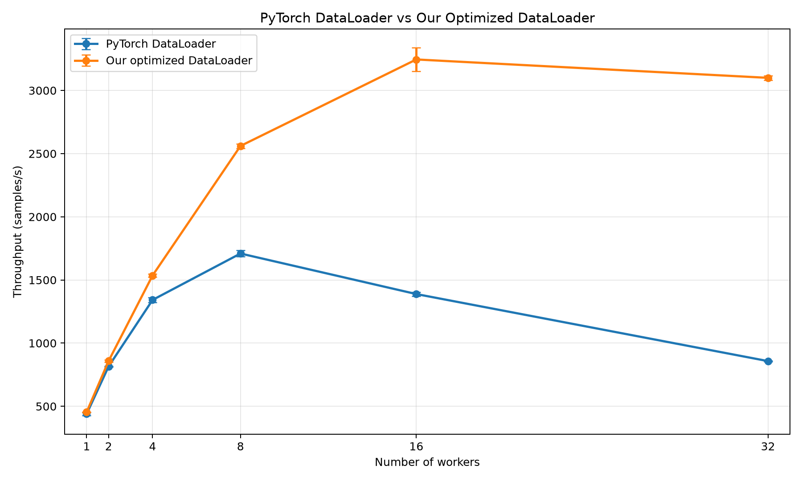
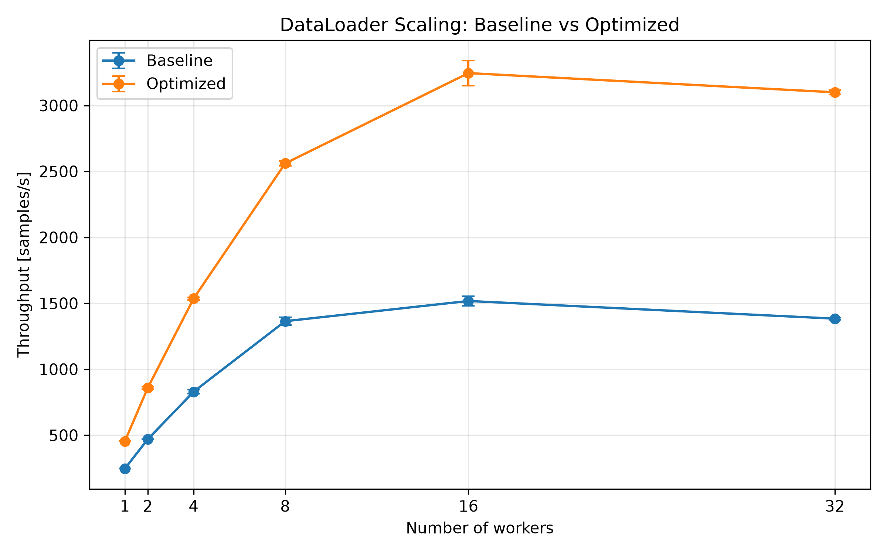

# Minimal Dependency Dataset Library for PyTorch

**Lightweight experimental data-loading library for PyTorch, developed as part of a Bachelor Project at DFKI.**

[](https://pypi.org/project/minimal-dataset-pytorch/)
[](https://www.python.org/)
[](https://pytorch.org/)

## Features

- Parquet-backed image datasets
- Multi-threaded data loading
- Lock-free sample distribution
- Chunked staging and batch processing
- Built-in performance instrumentation
- Compatible with standard PyTorch training loops

## Installation

Install directly from PyPI:

```bash
pip install minimal-dataset-pytorch
```

### Dependencies

The package directly depends on:

- `torch`
- `torchvision`
- `pyarrow`
- `Pillow`

Additional platform-specific dependencies required by PyTorch are installed automatically by `pip`.

`ParquetDataset` uses `torchvision.io` for JPEG decoding. Pillow is currently only used by `BaseDataset`.

## Quick Start

```python
from minimal_dataset import ParquetDataset, DataLoader

dataset = ParquetDataset("images.parquet")

loader = DataLoader(
    dataset,
    batch_size=256,
    num_workers=16,
)

for images, labels in loader:
    # training step
    pass
```

## Performance

The custom DataLoader was benchmarked against `torch.utils.data.DataLoader`
using the same Parquet dataset and preprocessing pipeline.

| Workers | PyTorch DataLoader | Custom DataLoader |
|---:|---:|---:|
| 1 | 439 samples/s | 454 samples/s |
| 2 | 816 samples/s | 859 samples/s |
| 4 | 1,342 samples/s | 1,536 samples/s |
| 8 | 1,709 samples/s | 2,561 samples/s |
| 16 | 1,388 samples/s | **3,245 samples/s** |
| 32 | 858 samples/s | 3,100 samples/s |

Peak measured throughput: **3,245 samples/s at 16 workers**.



The final optimizations increased peak throughput from approximately
**1,517 to 3,245 samples/s**.



## Notes

The current Parquet implementation loads the dataset eagerly into memory.

Performance reaches its maximum around 16 workers and slightly decreases at
32 workers. The remaining scaling bottleneck has been narrowed mainly to the
concurrent per-sample processing path but has not been fully isolated.

This package is an experimental research prototype and is not intended as a
production replacement for `torch.utils.data.DataLoader`.

## Author

**Pascal Nague**

Bachelor Project — DFKI  
Summer Semester 2026
