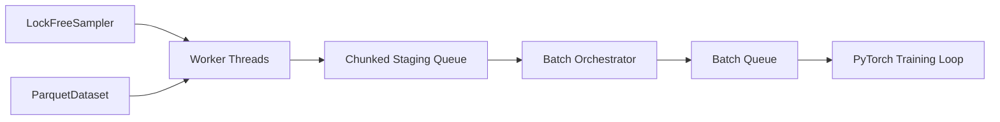

# minimal-dataset-pytorch

**A lightweight experimental PyTorch data-loading library for Parquet-backed image datasets, built and benchmarked during my Bachelor Project at DFKI.**

[](https://pypi.org/project/minimal-dataset-pytorch/)
[](https://www.python.org/)
[](https://pytorch.org/)

## Why this project?

Deep-learning performance is not only about the GPU. If the input pipeline cannot prepare batches fast enough, expensive compute resources spend time waiting for data.

This project explores a simple question:

> **Can a lightweight data-loading architecture provide competitive throughput while keeping integration with standard PyTorch training code simple?**

The goal was not to replace PyTorch's `DataLoader`, but to design an alternative architecture, measure it carefully, identify bottlenecks, optimize it, and understand where it works well — and where it does not.

## What I built

- Parquet-backed image dataset for PyTorch
- Multi-threaded data-loading pipeline
- Lock-free sample distribution
- Chunked staging between workers and batching
- Single batch orchestrator
- Built-in throughput and queue instrumentation
- Benchmark suite across multiple worker configurations
- PyPI package installable as `minimal-dataset-pytorch`
- External validation on Food-101

## Architecture



The loader keeps the training-loop interface familiar while moving sample loading and batching through a lightweight concurrent pipeline.

## Quick start

```bash
pip install minimal-dataset-pytorch
```

```python
from minimal_dataset import ParquetDataset, DataLoader

dataset = ParquetDataset("images.parquet")

loader = DataLoader(
    dataset,
    batch_size=256,
    num_workers=16,
)

for images, labels in loader:
    # training step
    pass
```

### Main dependencies

- `torch`
- `torchvision`
- `pyarrow`
- `Pillow`

`ParquetDataset` uses `torchvision.io` for JPEG decoding. Pillow is currently used by `BaseDataset`.

## Benchmark results

The custom loader was compared with `torch.utils.data.DataLoader` using the same benchmark workload.

**Configuration:** 9,984 samples · batch size 256 · 1–32 workers · 3 repetitions per configuration.

| Workers | PyTorch DataLoader | Custom DataLoader |
|---:|---:|---:|
| 1 | 439 samples/s | 454 samples/s |
| 2 | 816 samples/s | 859 samples/s |
| 4 | 1,342 samples/s | 1,536 samples/s |
| 8 | 1,709 samples/s | 2,561 samples/s |
| 16 | 1,388 samples/s | **3,245 samples/s** |
| 32 | 858 samples/s | 3,100 samples/s |

**Peak measured throughput: 3,245 samples/s at 16 workers.**


During optimization, peak throughput increased from approximately **1,517 to 3,245 samples/s**.


## External validation: Food-101

To test whether the original benchmark result generalized to another workload, I created a separate Food-101 benchmark project.

The result was important: the custom loader remained competitive at low worker counts, but PyTorch scaled better at higher worker counts on this workload.

That result changed the conclusion from **"faster DataLoader"** to a more useful engineering conclusion:

> **Data-loading performance is workload-dependent, and benchmark results should not be generalized without external validation.**

See the companion project: [food101-dataloader-benchmark](https://github.com/MrNague/food101-dataloader-benchmark)

## Current limitations

- Built-in dataset implementations are mainly image-focused
- The Parquet implementation currently loads the table eagerly into memory
- No integrated distributed/DDP sharding
- The current architecture uses one batch orchestrator
- Benchmarking focuses on data-loading throughput rather than full end-to-end training throughput
- The exact cause of the Food-101 high-worker scaling plateau has not yet been fully isolated

The concurrent loader itself can operate on arbitrary dataset samples and supports custom collation, but the provided datasets and default collation path are optimized primarily for images.

## Repository structure

```text
minimal_dataset/   Core library distributed through PyPI
benchmarks/        GPU and storage-format benchmarks
experiments/       Profiling, scaling and optimization experiments
tests/             Functional tests
training/          ResNet-50 training scripts
docs/              Architecture documentation and benchmark figures
```

Experimental implementations under `experiments/` are research code and are not part of the public package API.

## Project context

**Bachelor Project — DFKI, Kaiserslautern**  
**B.Sc. Computer Science — RPTU Kaiserslautern-Landau**  
**Author:** Pascal Nague  
**Summer Semester 2026**

This repository reflects both the implementation and the performance-engineering process behind the project: design, instrumentation, benchmarking, optimization, external validation, and honest analysis of limitations.
